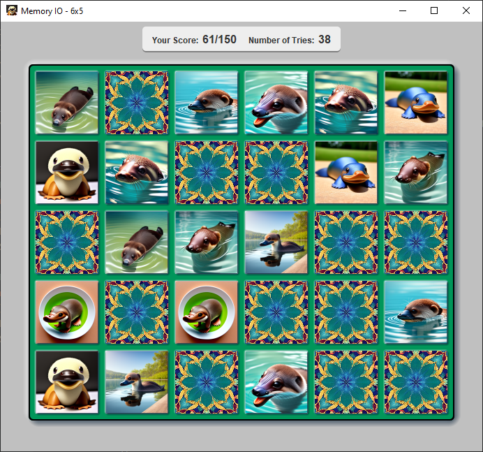
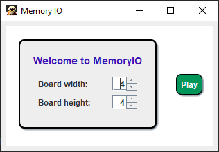
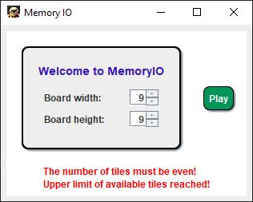
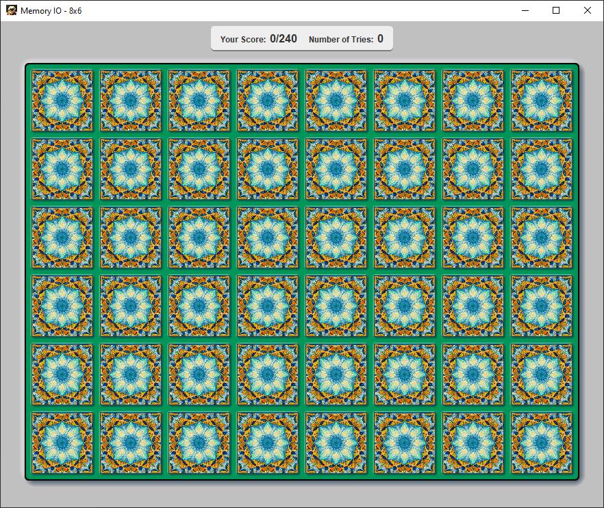
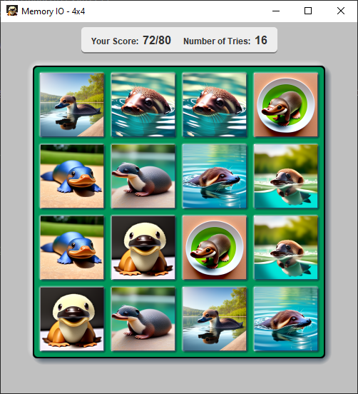
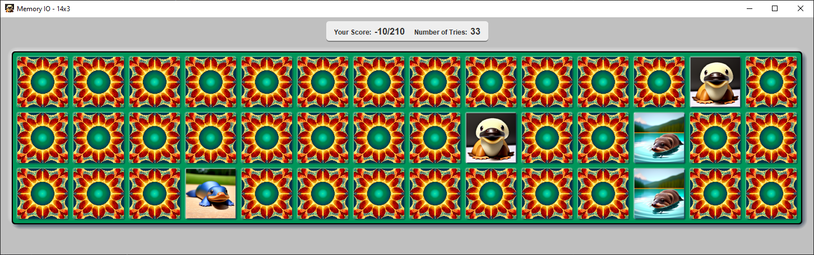
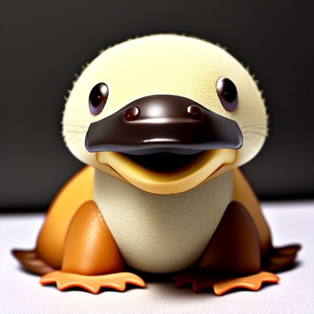

# MemoryIO




**The ultimate platypus memory trainer**

---


This is a simple memory game with a platypus theme. 
Its purpose is to help you to remember and differentiate between a variety of AI generated 
platypuses. 

Recommended for people that like memory and platypuses.


## Features

- Configurable game-board size
- Randomly shuffled platypus memory cards
- Randomly chosen card covers
- A fair score system
- Many unique platypus types

---

## Tech

### Dependencies

This application is based on the following technologies:

- Java Swing
- [SwingTree Library](https://github.com/globaltcad/swing-tree)
- [Spock Testing Framework](https://github.com/spockframework/spock) (Unit testing)
- [Gradle](https://gradle.org/) (Build tool)

### Design

This little application has been built with clean design patterns and testing practises.

The Frontend and the Business Logic are separated cleanly in order to facilitate the testing
of said Business Logic. This means that for every `View` class there is a corresponding 
`ViewModel` class which models its behaviour without depending on it.

Take a look at the following example code:

```java
var menu = new MainMenuViewModel();

menu.width.act(width);
menu.height.act(height);

var game = menu.startGame();
```

Custom Unit tests allow us to simulate likely user behavior in simple code by instantiating
and interacting with the various view models in our application.

---

## Overview

_The main menu:_



_Error messages appear if the input isn't feasible_:



A game-board with 48 tiles, which is currently the maximal available game size:



A solved 4x4 game-board, showing some cute AI platypuses:



A partially solved 6x5 game-board, highlighting the different look between the card covers
and the solved platypus pictures.

Note that the difficulty increases rapidly with larger game-boards, due to the platypus
pictures becoming more similar. This is done with the intention to challenge experienced
Memory players as well as platypus friends:


An example picture of a very long game-board. The freely adjustable game size allows for many
differently shaped boards:



~~~
Have fun!

Here is Timmy, the platypus mascot of MemoryIO
~~~


